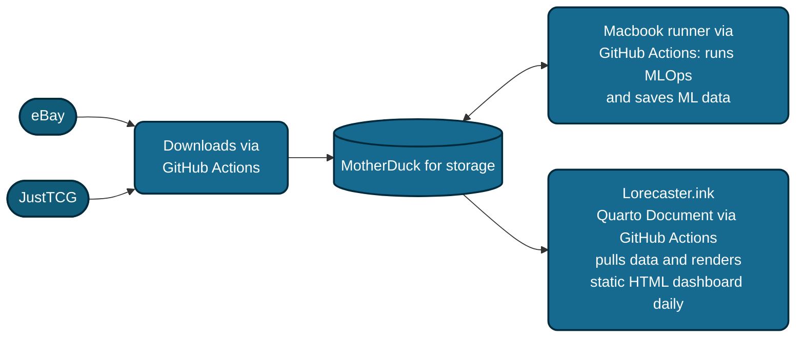

<p align="center">
  
</p>

<h1 align="center">
  Lorecaster:<br>
  Lorcana Market Data Analysis & Forecasting
</h1>


<p align="center">
  
  
  
  
  
  
  
</p>

> **Note:** This is an ongoing personal project and the README might occasionally be out of date as new features are tested.

🚀 **UPDATE: Lorecaster is up and is also mobile friendly!**

[](http://lorecaster.ink)
*Click the image above to explore the live market forecasts.*


---

## Table of Contents

**Getting oriented**
- [Overview](#overview)
- [The Live Dashboard](#the-live-dashboard)
- [Market Context & Dynamics](#market-context--dynamics)

**How it works**
- [Architecture at a Glance](#architecture-at-a-glance)
- [Data Pipeline & Ecosystem](#data-pipeline--ecosystem)
- [AI Data Cleaning (Gemma + Ollama)](#ai-data-cleaning-gemma--ollama)
- [Forecasting Models](#forecasting-models)
- [Market Health Metrics](#market-health-metrics)

**Operations**
- [Automation & Scheduling](#automation--scheduling)
- [Training & Inference Schedule](#training--inference-schedule)
- [Monitoring & Health](#monitoring--health)

**Reference**
- [Repository Structure](#repository-structure)
- [Tech Stack](#tech-stack)
- [Project Roadmap & To-Dos](#project-roadmap--to-dos)
- [Changelog](#changelog)
- [Disclosure](#disclosure)

---

## Overview

This repository houses my personal data pipeline and forecasting experiments for the **Disney Lorcana TCG**. It runs on a **Hybrid Local-Cloud Architecture** that pairs cloud-triggered market scraping with **local Large Language Model (LLM)** inference for data cleaning, then serves daily price forecasts and market-health metrics through a static dashboard at **[lorecaster.ink](http://lorecaster.ink)**.

Trading card games have incredibly speculative and volatile secondary markets. The central goal here is to **clean up inherently messy secondary-market data** as much as possible before feeding it into predictive models, ultimately producing forecasts and market-health signals that are stable enough to be trustworthy.

**Why this is hard — and interesting:**
- Public platforms mostly rely on basic moving averages; card prices actually behave more like thinly-traded equities, complete with regime changes, buyouts, and speculative spikes.
- Listing data is full of noise: keyword-stuffed titles, mislabeled rarities, graded/ungraded ambiguity, and duplicate listings.
- Newly released cards have little-to-no history, so a single model architecture can't cover the whole roster.

The project deliberately scopes to the **higher-end rarities (Epic, Enchanted, Iconic)** and to **ungraded** prices, where demand is driven more by collectibility than by the shifting competitive meta. See [Market Context & Dynamics](#market-context--dynamics) for the reasoning.

---

## The Live Dashboard

The public site at **[lorecaster.ink](http://lorecaster.ink)** is a **Quarto dashboard** (`index.qmd`) rendered to static HTML daily and served via GitHub Pages out of `docs/`. It pulls live data from MotherDuck at build time and hydrates interactive [Observable JS](https://observablehq.com/) components in the browser. The dashboard is organized into a few pages:

| Page | What it shows |
| --- | --- |
| **Market Overview** | Top-line market health, daily market velocity (listing churn vs. inflow), and headline movers. |
| **Market Explorer** | Per-card drill-down: price history, the 30-day forecast with confidence bands, and eBay listing context. |
| **Dashboard Guide & FAQ** | Plain-language explanation of the market, how the AI cleaning works, and a glossary of the advanced risk metrics. |
| **Support the Project!** | Project background and ways to support it. |

---

## Market Context & Dynamics

Introduced in 2023, **Disney Lorcana** is an interesting case study because it leverages Disney's massive library of intellectual property. Card pricing is driven by a combination of factors, and forecasting it well requires understanding the specific dynamics of this secondary market.

<details>
<summary><strong>Click to read more about Lorcana Market Dynamics & Project Context</strong></summary>

### 1. The Collectible vs. Playable Divide (Rarity)
Different rarities delineate whether a card is viewed primarily as a collectible or as a useful game piece. While both views exist, this project assumes that cards of higher rarities play more into the collectible aspect of demand. They are harder to "pull" from a pack and feature unique artworks. Because of this, Lorecaster focuses on the higher-end card rarities: **Epic, Enchanted, and Iconic**. Combining all rarities (including common/uncommon) would make modeling much more difficult, as lower-tier card prices fluctuate wildly based on the game's current competitive meta.

### 2. Artwork & Nostalgia
Special artwork and beloved Disney characters (like Stitch, a major focus for my own collection) evoke powerful emotional connections. This creates intrinsic value and high demand among collectors that doesn't always align with a card's actual playability.

### 3. Grading
A card's baseline value is tied to its pull rate, but the "Graded" market introduces wild price premiums. A graded card has been certified (usually on a scale of 1-10) by a third-party company (PSA, CGC, BGS) based on condition, centering, and aesthetics.

**Note:** My models currently predict the prices of **UNGRADED** cards. Graded cards, especially higher grades (9-10), sell for much higher premiums and swing much more steeply. It is also difficult to consistently capture graded pricing data due to a lack of freely available sources.

### 4. The eBay Factor
eBay is one of the major marketplaces for high-end TCG cards, making it a treasure trove for transaction data—especially since it permits the sale of graded cards (unlike TCGPlayer).
Listing prices on eBay can act as a strong indicator of future market prices when examined alongside listing volume history. While upper-echelon listing prices (Buy It Now / Best Offer) can be outliers, they often indicate:
1. The card is rare/new, and a market price hasn't been established.
2. The seller is misreading the market.
3. Simple listing errors.

<div align="center">
  <table>
    <tr>
      <td align="center">
        
        <br>
        <em>Iconic: Mickey Mouse </em>
      </td>
      <td align="center">
        
        <br>
        <em>Enchanted: Mickey Mouse</em>
      </td>
      <td align="center">
        
        <br>
        <em>Epic: Stitch </em>
      </td>
    </tr>
  </table>
</div>


</details>

---

## Architecture at a Glance

Lorecaster is intentionally split between the **cloud** (for triggering and coordination) and a **local MacBook Air self-hosted runner** (for the heavy lifting: scraping, LLM inference, and model training). A single **MotherDuck** (cloud DuckDB) database is the shared source of truth that ties everything together.



**Design choices worth calling out:**
- **Self-hosted runner over cloud CI:** All jobs `runs-on: self-hosted`. The MacBook already has a pristine R + Python + Quarto + Ollama environment, so workflows skip the 15-minute R setup and package installs entirely — and Ollama-based LLM cleaning simply isn't feasible on a standard cloud runner.
- **MotherDuck as the single source of truth:** Every stage reads from and writes to the same cloud DuckDB database (`md:my_db`), so scraping, cleaning, modeling, and the dashboard all agree on state.
- **Static HTML over a live app:** The dashboard is pre-rendered daily rather than served from a live backend, which handles web traffic cheaply while still reflecting the latest data.

---

## Data Pipeline & Ecosystem

The pipeline moves data through six stages, mirrored by the `pipeline/` folder layout (see [Repository Structure](#repository-structure)):

**1. Sourcing / Ingestion** — `pipeline/ingestion/`
- **`ebay_api_download.R`** authenticates with the eBay OAuth API and pulls active listings (price, title, URL, graded flag) for every target card, writing the raw float to the `lorcana_active_listings` table.
- **`pull_daily_prices.R`** hits the **JustTCG** API in batches of 20 `tcgplayer_id`s (Near-Mint condition) and writes daily market prices to the `justtcg_prices` table.
- Both scripts read the shared roster from `data/target_cards_with_epids2.csv`, keeping every stage aligned on the same set of cards.

**2. AI Cleaning** — `pipeline/cleaning/` (see [AI Data Cleaning](#ai-data-cleaning-gemma--ollama) for detail)
- **`run_gemma_cleaner.R`** validates and structures new eBay listings via a local Gemma model, updating `llm_listing_metadata`.
- **`dedupe_gemma4.R`** performs a second LLM pass to prune mislabeled/duplicate listings.

**3. Preprocessing** — `pipeline/preprocessing/`
- **`preprocessing.R`** pulls prices for cards with **≥180 days** of history, fills temporal gaps (forward-fill across missing days), scales features, derives the per-card **eBay churn rate + coverage mask** (see [eBay Churn Signal](#the-ebay-churn-signal)), and writes the model-ready matrix to `data/pytorch/lorcana_pytorch_ready.csv`.
- **`chronos_data_processing.R`** builds a lighter dataset for cards with **≥90 days** of history (`data/chronos_ready_prices.csv`) so newer cards can still be forecast by the zero-shot transformer.

**4. Forecasting** — `pipeline/modeling/` + `pipeline/inference/`
- Daily inference and weekly training run the PyTorch models and push predictions to the `gru_predictions` and `chronos_predictions` tables. See [Forecasting Models](#forecasting-models).

**5. Post-processing** — `pipeline/postprocessing/`
- **`update_residuals.R`** joins predictions against realized prices in-database to populate `model_residuals_live`.
- **`calculate_backtest_metrics.R`** computes 30-day forecast errors for the dashboard.
- **`model_diagnostics.R`** rolls up model performance history.
- **`update_ts_metrics.R`** computes per-card market-health metrics into `card_ts_metrics` (see [Market Health Metrics](#market-health-metrics)).

**6. Deployment** — `index.qmd` → `docs/`
- The Quarto dashboard reads the latest production inferences and metrics from MotherDuck and renders a fresh static site daily.

<details>
<summary><strong>Key MotherDuck tables</strong></summary>

| Table | Written by | Purpose |
| --- | --- | --- |
| `justtcg_prices` | `pull_daily_prices.R` | Daily market prices per card |
| `lorcana_active_listings` | `ebay_api_download.R` | Raw eBay active-listing float |
| `llm_listing_metadata` | `run_gemma_cleaner.R`, `dedupe_gemma4.R` | LLM match/grade metadata per listing |
| `gru_predictions` | `daily_inference_gru.py` | 30-day GRU forecasts |
| `buy_hold_sell_scores` | `buy_hold_sell_multinom.R` | Daily calibrated buy/hold/sell probabilities per card |
| `buy_hold_sell_metrics` | `buy_hold_sell_multinom.R` | Per-run model health (AUC, Brier, today's avg confidence) |
| `chronos_predictions` | `chronos_transfer_learning.py` | 30-day Chronos forecasts |
| `model_residuals_live` | `update_residuals.R` | Live prediction-vs-actual residuals |
| `card_ts_metrics` | `update_ts_metrics.R` | Entropy, Hurst, skew, autocorrelation, volatility |
| `model_performance_history` / `model_runs` | `model_diagnostics.R` | Backtest performance history |

</details>

---

## AI Data Cleaning (Gemma + Ollama)

The single biggest source of noise is eBay listing text. Sellers stuff titles with high-value keywords ("Enchanted", "Iconic", "PSA 10") to catch searches, and the same card shows up under wildly inconsistent formatting. To fix this, new listings are run through a **local Gemma model served by [Ollama](https://ollama.com/)** on the MacBook runner (`gemma4:e2b`, `temperature = 0.0` for deterministic extraction).

The model does two jobs:

- **Title Validation** — a strict character-and-subtitle check plus **collector-number matching** (e.g., understanding that a title reading `242/204` is an exact match for target number `242`, while a genuinely different number is a "No Match"). This filters out keyword-stuffed and mislabeled listings.
- **Structured Extraction** — messy title strings are turned into structured JSON:
  - **Match Validity:** `Match` / `No Match`
  - **Grading Status:** `true` / `false`
  - **Grading Company:** PSA, BGS/Beckett, CGC, SGC, PCG, ACE, TAG
  - **Grade Value:** e.g. `10`, `9.5`, `9`

**Incremental "delta-only" processing:** new `item_id`s are cross-referenced against existing metadata so each listing is only ever sent through the LLM once. This keeps a local model tractable over a growing dataset and is the reason cleaning can run every day on a laptop.

The eBay + cleaning jobs are chained sequentially (scrape → clean → dedupe) so Ollama is never asked to serve two heavy jobs at once.

---

## Forecasting Models

Price forecasting is treated as a **multi-modal time-series problem**. Two architectures run side by side, chosen for complementary strengths.

### 1. Hybrid Gated Recurrent Unit (GRU) — the primary model

A custom **PyTorch** model that ingests both temporal data (historical prices) and static metadata (set, rarity, ink color). By concatenating static embeddings with recurrent outputs, it contextualizes price movement — learning, for example, that an "Enchanted" card's volatility behaves differently from a "Rare" card's.

1. **Temporal Branch:** a 4-feature-per-step sequence (normalized price + relative day + **eBay churn rate** + an **eBay-coverage mask**) flows through a multi-layer GRU. The churn features inject a demand-side signal on top of raw price history (see [eBay Churn Signal](#the-ebay-churn-signal)).
2. **Static Branch:** categorical attributes are mapped into dense vectors via PyTorch `nn.Embedding` layers, alongside a couple of continuous static features (cost, inkwell).
3. **The Merge:** attention-summarized sequence features and static embeddings are concatenated and passed through a final MLP to produce the 30-day forecast.

<details>
<summary><strong>Architecture & training internals</strong></summary>

**Network (`HybridLorcanaGRU`):**
- **GRU:** input size 4 (price, relative day, eBay churn rate, eBay-coverage mask) → hidden size 128, 2 layers, dropout 0.4. The channel set is toggled by the `USE_EBAY_FEATURES` flag (env-overridable) so the 2-channel price-only baseline can be reproduced for A/B comparison.
- **Additive attention:** `Linear(128→64) → Tanh → Linear(64→1)`, softmax over the time axis to produce a weighted **context vector** — instead of relying on only the final hidden state.
- **Embeddings:** `set → 4`, `rarity → 8`, `ink → 2` dimensions, concatenated with 2 continuous static features (16 static dims total).
- **Head:** `Linear(hidden+16 → 64) → ReLU → Dropout(0.5) → Linear(64 → 30)`.
- **Residual output:** the forecast is `last_price + tanh(head(...)) * 0.1` — the model predicts a **bounded delta** from the last known price rather than an absolute value, which greatly improves stability.

**Training (`train_lorcana_model.py`, `model_testing_gru.py`):**
- **Custom "Horizon Trend" loss:** `SmoothL1Loss` (Huber) as a base to absorb outliers, plus a **directional penalty** that punishes predicting the wrong market direction on *significant* moves (>2% of last price), scaled up over the horizon (a time-weighted `linspace(0→1)`, `max_penalty = 0.5`). It ignores daily noise but heavily penalizes missing the macro destination.
- **Multi-window training:** models are trained across **15, 30, and 45-day** lookback windows to find the best signal-to-noise ratio, evaluated via **wMAPE** (volume-weighted MAPE) and directional accuracy.
- **Rolling-origin backtesting:** 3 folds, each shifting the origin 30 days into the past, stress-testing the architecture against historical regime changes and set releases.
- **Optimizer / regularization:** AdamW (`lr=1e-3`, `weight_decay=1e-2`), `ReduceLROnPlateau`, gradient clipping (max-norm 0.5), early stopping (patience 15), up to 100 epochs.
- **Confidence intervals:** Monte-Carlo dropout at inference (dropout left active, 100 samples) yields a **median** forecast plus **10th/90th-percentile** bands.

</details>

#### The eBay Churn Signal

Price history alone tells you *where* a card has been, not how hard it's being bought. To capture demand pressure, `preprocessing.R` derives a per-card, per-day **churn rate** from the eBay listing float: the count of listings whose *last observed day* is that day (i.e., delisted/sold), divided by the day's active listing count. Intuitively, listings disappearing = supply being absorbed = bullish; a build-up of new listings = bearish.

- **Why churn, not raw volume:** in backtesting, raw active-listing count barely correlates with forward price (within-card *r* ≈ 0.02), while normalized churn is the strongest of the flow features (*r* ≈ +0.16 against the 7-day forward return) — and it's orthogonal to price, so it's additive rather than redundant.
- **Shorter history, handled honestly:** eBay coverage (~3.5 months) is much shorter than price history (~14 months). Churn is fed as a dynamic GRU channel alongside a binary **coverage mask**; pre-eBay days get `churn = 0, mask = 0` so the network can *gate* the feature to the window where it actually exists rather than treating missing as zero-demand.
- **No look-ahead:** the most recent pull date is excluded from churn (every still-live listing would falsely look "removed" until the next pull is observed — right-censoring).
- **Measured lift:** rolling-origin A/B (churn on vs. off) shows churn improves **directional accuracy across every horizon** for both windows, and on the **30-day model** it also cuts magnitude error (wMAPE −1.8 to −2.1 pp at the 6–30-day horizons). The 30-day window is therefore the production served model.

### 2. Pre-trained Transformer (Amazon Chronos) — the cold-start model

**[Chronos](https://github.com/amazon-science/chronos-forecasting)** is a time-series forecasting framework built on language-model architectures.
- **Mechanism:** it tokenizes price values and uses a transformer to predict the next tokens in the sequence.
- **Why it's here:** solid **zero-shot** forecasting out of the box, which is invaluable for **newly released cards** that lack the history required to train the GRU effectively (hence the 90-day preprocessing threshold vs. the GRU's 180).

Running both lets the dashboard compare them and surface **model divergence** as its own signal (see [Monitoring & Health](#monitoring--health)).

### 3. Buy / Hold / Sell Signal — calibrated multinomial logistic

Where the GRU and Chronos answer *"what will the price be?"*, this model answers the decision question directly: *"is now a good time to **buy**, **hold**, or **sell**?"* It is a **regularized multinomial logistic regression** (R, **tidymodels** + `glmnet`) that emits three **calibrated probabilities per card that sum to 1** — chosen deliberately because logistic regression yields interpretable coefficients and honest, well-calibrated probabilities rather than a black-box score.

- **Label (looks ~3 weeks forward):** `sell` if the price is likely to fall (≤ −7%), `buy` if it is likely to rise **and** the card is currently near a low (≥ +7% **and** in the bottom half of its all-time range), `hold` otherwise. Horizon and thresholds were picked by a walk-forward sweep (21 days / ±7% gave the best balanced AUC).
- **Predictors (all leakage-safe, as of day t):** TCG price dynamics (momentum, moving-average gaps, volatility, skew), each card's **all-time high/low position**, and — where eBay data exists — **listing volume, churn, and the eBay/TCG premium** (imputed on the older pre-eBay days). The `card_ts_metrics` snapshot is deliberately *not* used as a feature, since applying today's 30-day stats to a historical row would leak the future; the equivalent stats are recomputed per-day from the price series instead.
- **Calibration:** probabilities are refit each run with **beta calibration** (isotonic fallback) on the most recent slice, and the walk-forward holdout re-calibrates per window to track regime shift — so a reported 70% really means ~70%.
- **Honest performance:** strictly time-based validation with an embargo gap. Walk-forward macro-AUC ≈ **0.71** (a real but modest edge — 3-week moves are hard), calibrated Brier ≈ 0.22. The probabilities are trustworthy enough to *rank and size* decisions, not to bet the farm on a single card.
- **Output:** `pipeline/modeling/buy_hold_sell_multinom.R` fits, calibrates, scores the latest day for every card, writes `data/pytorch/buy_hold_sell_scores.csv`, and pushes to the `buy_hold_sell_scores` table. Each run also records model-health metrics (AUC, Brier, and today's average confidence) to `buy_hold_sell_metrics`. The dashboard surfaces the three probabilities inside each card's deep-dive (with a hold-confidence colour gradient and a per-card confidence read-out), plus a global model-health card that puts the AUC/calibration into plain language.

---

## Market Health Metrics

Beyond price forecasts, `update_ts_metrics.R` computes a suite of **statistical health metrics** per card over a rolling 30-day window (surfaced in the dashboard's glossary). These describe *how a card trades*, not just where its price is:

| Metric | Library | What it tells you |
| --- | --- | --- |
| **Sample Entropy** | `pracma` | Unpredictability / structural randomness of the price series. |
| **Hurst Exponent** | `pracma` | Momentum vs. mean-reversion. `>0.5` trends, `<0.5` reverts, `≈0.5` random walk. |
| **Lag-1 Autocorrelation** | base R | How much today's move persists into tomorrow. |
| **Skewness** | `moments` | Asymmetry of returns (crash-prone vs. spike-prone). |
| **Volatility / CV** | base R | Risk profile via coefficient of variation. |

All are wrapped in **safe-math guards** (minimum length, zero-variance checks, `tryCatch`) so a thin or flat series degrades to `NA` rather than crashing the daily job.

> An early exploratory extension of this idea — a 21-day volume-turnover / 7-day price-movement classification dataset — lives in `exploration/softmax.R` and is not yet part of the production pipeline.

---

## Automation & Scheduling

Everything is orchestrated by **six GitHub Actions workflows**, all on the self-hosted MacBook runner. Two daily "chains" fan out from the morning scrape, plus a weekly retrain. Times are UTC.

| Workflow | Trigger | Runs |
| --- | --- | --- |
| **JustTCG Daily Price Pull** | daily `04:23` | `pipeline/ingestion/pull_daily_prices.R` |
| **eBay Daily Market Float** | daily `04:23` | eBay scrape → Gemma clean → Gemma dedupe (3 chained jobs) |
| **Update Time Series Metrics** | daily `04:30` | `pipeline/postprocessing/update_ts_metrics.R` |
| **Daily Lorcana Market Inference** | after *JustTCG Price Pull* succeeds | preprocess → GRU + Chronos inference → residuals → backtest metrics |
| **Daily Buy/Hold/Sell Signal** | after *eBay Market Float* succeeds | refit calibrated logistic on fresh price + eBay data → push buy/hold/sell probabilities |
| **Daily Dashboard Render** | after *eBay Market Float* succeeds | `quarto render index.qmd`, commit to `docs/` |
| **Weekly Lorcana Training** | Sundays `04:26` | preprocess → train GRU + Chronos backtests → diagnostics → back up weights |

**Chaining:** the two daily scrapers kick off downstream work via `workflow_run: completed` triggers rather than fixed timers, so inference and dashboard rendering only fire once fresh data has actually landed. The weekly training job additionally backs up the `.pth` weights to a timestamped local folder before syncing them to git.

---

## Training & Inference Schedule

The GRU engine follows a strict separation between **evaluation** and **production** so the model deployed to users is never quietly overfit to its own test set:

1. **The Evaluator (`pipeline/modeling/model_testing_gru.py`):** the "Honest Grader." Performs rolling-origin backtesting across three historical eras; the most recent fold acts as an unseen holdout, isolating real-world performance metrics and exporting them (`data/pytorch/lorcana_global_metrics.csv`) for the dashboard.
2. **The Production Brain (`pipeline/modeling/train_lorcana_model.py`):** runs weekly after evaluation. Trains on **100% of the historical dataset** for a fixed "sweet spot" of epochs, producing the smartest possible `.pth` weights without locking the most recent 30 days of market momentum behind a test-set wall.
3. **Daily Inference (`pipeline/inference/daily_inference_gru.py`):** loads the production weights, generates the 30-day forecast (with Monte-Carlo confidence bands), and pushes predictions to MotherDuck.

---

## Monitoring & Health

- **Model Divergence:** tracking how far the Hybrid GRU and Chronos predictions drift apart — wide divergence flags uncertainty.
- **Data Integrity:** monitoring the "Match" rate coming out of Gemma. A sudden drop usually means eBay listing patterns or seller jargon have shifted, requiring a prompt adjustment.
- **Outlier Detection:** flagging cards whose predictions diverge sharply from realized prices, which usually points to a data flaw or an unpredictable market buyout.

---

## Repository Structure

Scripts are grouped by pipeline stage. Anything under `pipeline/` is part of the automated flow; `exploration/` holds ad-hoc and experimental work; `archive/` holds deprecated code kept for reference.

```
lorcana/
├── index.qmd                     # Quarto dashboard (rendered daily → docs/)
├── _quarto.yml                   # Quarto project config (output-dir: docs)
├── docs/                         # Rendered static site (GitHub Pages)
├── data/                         # Model-ready CSVs, weights, images, metadata
│   ├── pytorch/                  #   GRU/Chronos weights (.pth) & forecasts
│   ├── enchanteds/               #   Card lists + .avif art
│   ├── tabular/ running_data/ …  #   Intermediate datasets
│   └── target_cards_with_epids2.csv   # Shared card roster (all stages read this)
│
├── pipeline/
│   ├── ingestion/                # ebay_api_download.R, pull_daily_prices.R
│   ├── cleaning/                 # run_gemma_cleaner.R, dedupe_gemma4.R
│   ├── preprocessing/            # preprocessing.R, chronos_data_processing.R
│   ├── modeling/                 # train_lorcana_model.py, model_testing_gru.py,
│   │                             #   chronos_transfer_learning.py, chronos_backtest.py,
│   │                             #   buy_hold_sell_multinom.R (buy/hold/sell logistic)
│   ├── inference/                # daily_inference_gru.py
│   └── postprocessing/           # update_residuals.R, update_ts_metrics.R,
│                                 #   calculate_backtest_metrics.R, model_diagnostics.R
│
├── exploration/                  # Ad-hoc analysis & experiments (softmax.R, etc.)
├── archive/shiny_app/            # Deprecated Shiny app (kept for reference)
└── .github/workflows/            # 6 GitHub Actions workflows (see Automation)
```

---

## Tech Stack

| Layer | Tools |
| --- | --- |
| **Languages** | R, Python (developed in [Positron](https://positron.posit.co/), which runs both) |
| **Data / ML (Python)** | PyTorch, pandas, NumPy, Amazon Chronos, duckdb, python-dotenv |
| **Data / stats (R)** | tidyverse, DBI + duckdb, httr, jsonlite, `pracma`, `moments`, lubridate |
| **ML (R)** | tidymodels (`parsnip`, `recipes`, `rsample`, `tune`, `yardstick`), `glmnet`, `probably` + `betacal` (calibration), `slider` |
| **LLM cleaning** | Ollama serving Gemma (`gemma4:e2b`), local on the runner |
| **Storage** | MotherDuck (cloud DuckDB) |
| **Data sources** | eBay Browse API, JustTCG API, Lorcast (card metadata) |
| **Dashboard** | Quarto (dashboard format) + Observable JS, deployed to GitHub Pages |
| **Automation** | GitHub Actions on a self-hosted MacBook Air runner |

---

## Project Roadmap & To-Dos
- [ ] **Blue Chip Index:** Develop a weighted index (e.g., tracking the Top 50 Enchanteds) to get a quick pulse on the overall health of the Lorcana market.
- [ ] **Modularize `index.qmd`** into smaller, maintainable components.
- [ ] **Diffusion Transformers & Sentiment:** Begin experimenting with diffusion transformer models and using LLMs to capture textual market sentiment.
- [ ] **Rework the landing page** to include more interesting statistics.
- [x] **Buy vs. Sell decision maker** leveraging the models and market metrics — shipped as a calibrated buy/hold/sell logistic (see [Forecasting Models](#forecasting-models)); next up is folding the GRU/Chronos forecasts in as features.

---

## Changelog
*(significant changes only)*

- **2026-07-12** — Added a **Buy / Hold / Sell signal**: a calibrated multinomial logistic (tidymodels + `glmnet`) in `pipeline/modeling/buy_hold_sell_multinom.R` emitting three probabilities per card from TCG price dynamics, all-time high/low position, and eBay volume/churn/premium. Walk-forward tuned (21d / ±7%) and beta-calibrated; scores land in the `buy_hold_sell_scores` table, refresh via the new **Daily Buy/Hold/Sell Signal** workflow, and appear in each card's dashboard deep-dive.
- **2026-07-12** — Added an **eBay churn signal** to the GRU: `preprocessing.R` now derives a per-card, per-day listing churn rate + coverage mask, and the GRU temporal branch went from 2 to 4 input channels (`USE_EBAY_FEATURES` flag). Rolling-origin A/B showed churn lifts directional accuracy at every horizon and cuts wMAPE on the 30-day model, so **daily inference now serves the 30-day window**.
- **2026-07-06** — Reorganized root-level scripts into `pipeline/{ingestion,cleaning,preprocessing,modeling,inference,postprocessing}` and `exploration/`, matching the data-pipeline stages above; updated all GitHub Actions workflows to the new paths.
- **2026-06-12** — Switched storage from Neon (PostgreSQL) to **MotherDuck**, after realizing the use case didn't require Neon's features.
- Removed the DigitalOcean/Docker approach in favor of a daily-rendered static HTML page, which better supports web traffic while still showing daily data and market changes.
- The Shiny app code is retained in `archive/shiny_app` but is no longer actively used and is out of date.

---

## Disclosure

This project blends R and Python, packaged with Quarto and JavaScript. **AI has been used to help develop the JS and clean up code.** However, the **business logic, market context, domain knowledge, and modeling design were all developed by me** — the author.
