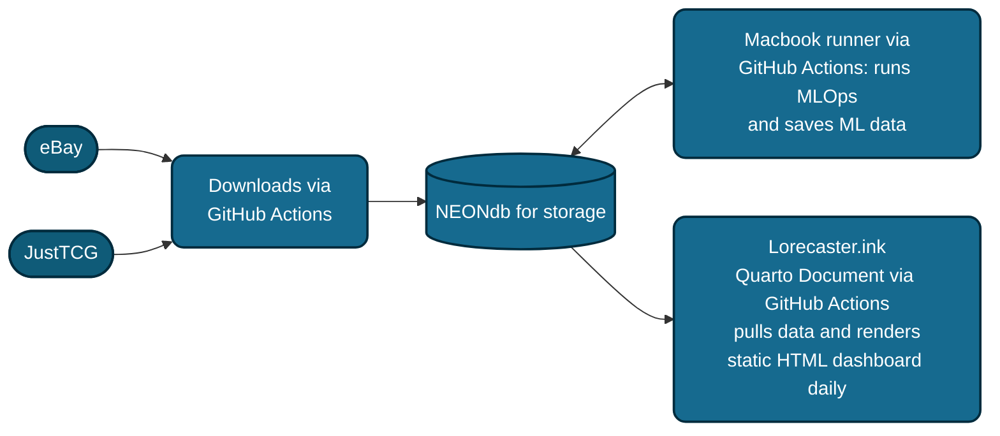

# Lorecaster: Lorcana Market Data Analysis & Forecasting 

  
  
  
  
  
  

> **Note:** This is an ongoing personal project and the README might occasionally be out of date as new features are tested. 

🚀 **UPDATE: Lorecaster is up!**

*Click the image above to explore the live market forecasts.*

---

## Table of Contents
- [Project Overview](#project-overview)
- [Context & Market Dynamics](#context--market-dynamics)
- [Data Pipeline & Ecosystem](#data-pipeline--ecosystem)
- [Forecasting Models](#forecasting-models)
- [Training & Inference Schedule](#training--inference-schedule)
- [Project Roadmap & To-Dos](#project-roadmap--to-dos)

---

## Brief Overview
This repository houses my personal data pipeline and forecasting experiments for the Disney Lorcana TCG. I've set up a **Hybrid Local-Cloud Architecture** that combines cloud scraping with local **Large Language Model (LLM)** inference. 

Trading card games (TCGs) have incredibly speculative and volatile secondary markets. The main goal of this project is to clean up inherently messy secondary market data as much as possible before feeding it into predictive models, ultimately providing stable forecasts and market health metrics.

---

## Context
Trading cards are mostly viewed as collectibles with a very niche secondary market. However, nowadays they are now being adapted and viewed as an asset class by many people around the world. This theme/concept is often highlighted by publicly documented purchases of trading cards that go into the millions of USD along with other events/newsreels etc. Perhaps one of the most difficult things to apply to the card secondary market has been a accurate predicitve framework that can be leveraged to forecast the likelihood of future price trends. Like the stock market, predicting prices of trading cards is not easy and there is doubt on whether it is possible. This doubt and difficulty is best illustrated by the fact that to my knowledge there exists no predictive forecasting platform of card pricing that is available to the general public that goes beyond moving averages. Here I attempt to make an initial foray into the development of a predictive analytical pipeline for trading cards based on several machine learning approaches that are entwined with automated MLOps.  

## Lorcana

Introduced in 2023, **Disney Lorcana** is an interesting case study because it leverages Disney's massive library of intellectual property. The pricing of cards is a combination of multiple factors, and to accurately forecast prices, we have to understand the specific dynamics driving this secondary market.

### 1. The Collectible vs. Playable Divide (Rarity)
Different rarities delineate whether a card is viewed primarily as a collectible or as a useful game piece. While both views exist, this project assumes that cards of higher rarities play more into the collectible aspect of demand. They are harder to "pull" from a pack and feature unique artworks. Because of this, Lorecaster focuses on the higher-end card rarities: **Epic, Enchanted, and Iconic**. Combining all rarities (including common/uncommon) would make modeling much more difficult, as lower-tier card prices fluctuate wildly based on the game's current competitive meta.

### 2. Artwork & Nostalgia
Special artwork and beloved Disney characters (like Stitch, a major focus for my own collection) evoke powerful emotional connections. This creates intrinsic value and high demand among collectors that doesn't always align with a card's actual playability.

### 3. Grading 
A card's baseline value is tied to its pull rate, but the "Graded" market introduces wild price premiums. A graded card has been certified (usually on a scale of 1-10) by a third-party company (PSA, CGC, BGS) based on condition, centering, and aesthetics. 

**Note:** My models currently predict the prices of **UNGRADED** cards. Graded cards, especially higher grades (9-10), sell for much higher premiums and swing much more steeply. It is also difficult to consistently capture graded pricing data due to a lack of freely available sources.

### 4. The eBay Factor
eBay is one of the major marketplaces for high-end TCG cards, making it a treasure trove for transaction data—especially since it permits the sale of graded cards (unlike TCGPlayer). 
Listing prices on eBay can act as a strong indicator of future market prices when examined alongside listing volume history. While upper-echelon listing prices (Buy It Now / Best Offer) can be outliers, they often indicate:
1. The card is rare/new, and a market price hasn't been established.
2. The seller is misreading the market.
3. Simple listing errors.

  <table>
    <tr>
      <td align="center">
        
         
        <em>Iconic: Mickey Mouse </em>
      </td>
      <td align="center">
        
         
        <em>Enchanted: Mickey Mouse</em>
      </td>
      <td align="center">
        
         
        <em>Epic: Stitch </em>
      </td>
    </tr>
  </table>

---

## Data Pipeline & Ecosystem

1. **Sourcing (Cloud):** GitHub Actions (Ubuntu-latest) runs a daily scrape of **eBay** and **JustTCG**, pushing the raw, unfiltered logs to a **Neon (PostgreSQL)** database.
2. **AI Cleaning (Local MacBook Runner):** After the cloud scrape finishes, a self-hosted runner wakes up on my local MacBook Air. It pulls new `item_ids`, runs them through **Gemma 4.0** via my local **Ollama** instance, and updates the `llm_listing_metadata` table.
    * **Title Validation:** Gemma performs a character-and-subtitle check to verify the listing matches the target card exactly, filtering out seller "keyword stuffing."
    * **Structured Extraction:** The model extracts structured JSON data from messy eBay listing strings to identify:
        * **Match Validity:** (Match/No Match)
        * **Grading Status:** (True/False)
        * **Grading Company:** (PSA, BGS, CGC, SGC, PCG)
        * **Grade Value:** (e.g., 10, 9.5, 9)
    * **Incremental Processing:** To save on compute time, a "Delta-only" approach cross-references new `item_ids` against existing metadata. Each listing only goes through the AI extraction process once.
3. **Preprocessing:** Data is preprocessed primarily in **R** to filter out items unsuitable for the deep learning process and to remove problematic data structures.
4. **Forecasting:** Managed via **PyTorch** (detailed in the [Forecasting Models](#forecasting-models) section below).
5. **Deployment (Quarto):** Forecasts and market metrics are presented via the Lorecaster dashboard, an html page updated daily to show the latest pricing, forecasts, and ebay data. 
---

## Forecasting Models

I'm approaching price forecasting as a multi-modal time-series problem. I am currently testing two different architectures to see what handles the volatility best:

### 1. Hybrid Gated Recurrent Unit (GRU)
I built a custom **PyTorch** model that ingests both temporal data (historical prices) and static metadata (card rarity, ink color). By concatenating static embeddings with recurrent outputs, the model better contextualizes price movements (e.g., learning that an "Enchanted" card's volatility behaves differently than a "Rare" card's).

**Why a Hybrid GRU?**
Standard time-series models treat every variable identically. Our hybrid approach separates them:
1. **Temporal Branch:** A multi-layer GRU processes sequences of normalized price data and relative days.
2. **Static Branch:** Categorical attributes are mapped into dense vector spaces using PyTorch `nn.Embedding` layers. 
3. **The Merge:** Sequence features and static embeddings are concatenated and passed through a final multi-layer perceptron (MLP) to generate the 30-day forecast.

#### The Attention Mechanism
To handle the erratic nature of the secondary market, I implemented an **Additive Attention Mechanism** over the GRU outputs. Instead of relying on a final hidden state to summarize a 30-day window, the attention layer calculates a dynamic weight for *every* day. This "Context Vector" allows the model to prioritize sudden price shocks or market shifts.

**Key Features of the Training Pipeline:**
* **Multi-Window Training:** Models are trained across different historical lookback windows (15, 30, and 45 days) to find the optimal signal-to-noise ratio, evaluated via metrics like **wMAPE** (Volume-Weighted MAPE).
* **Rolling-Origin Backtesting:** A time-traveling validation approach that simulates past market eras to stress-test the architecture against historical regime changes and set releases.
* **Custom "Horizon Trend" Loss Function:** Uses `SmoothL1Loss` (Huber Loss) as a base to handle extreme outliers, but adds a dynamic penalty for guessing the wrong market direction. It ignores daily pricing noise but heavily punishes missing the long-term macro destination.
* **Residual Forecasting:** The model predicts the *delta* (change in price) from the last known data point rather than the raw absolute value, greatly improving stability.

### 2. Pre-trained Transformer (Amazon Chronos)
I'm also experimenting with **Chronos**, a time-series forecasting framework built on language model architectures.
* **Mechanism:** Chronos tokenizes price values and uses a transformer to predict the next tokens in the sequence. 
* **Theory:** It provides solid zero-shot forecasting out of the box, which is incredibly helpful for newly released cards that lack the historical data required to train the GRU effectively.

---

## Training & Inference Schedule

To bridge the gap between academic model evaluation and real-world deployment, the GRU forecasting engine operates on a strict **Two-Script Pipeline**:

1. **The Evaluator (`model_testing_gru.py`):** Runs weekly. This acts as the "Honest Grader," performing rolling-origin backtesting across three historical eras. The most recent fold acts as an unseen holdout set, isolating real-world performance metrics and exporting them to `lorcana_global_metrics.csv` for the dashboard.
2. **The Production Brain (`train_lorcana_model.py`):** Runs weekly after evaluation. A lean script that trains the model on **100% of the historical dataset** for a fixed "sweet spot" of epochs. This creates the smartest possible `.pth` weights file without locking the most recent 30 days of market momentum behind a test-set wall. 
3. **Daily Inference (`daily_inference_gru.py`):** Runs daily. It loads the production weights, generates the 30-day future forecast, and pushes predictions to the Neon PostgreSQL database.

### Monitoring & Health
* **Model Divergence:** Tracking how wildly the Hybrid GRU and Chronos predictions differ from one another.
* **Data Integrity:** Monitoring the "Match" rate coming out of Gemma. A sudden drop usually means eBay listing patterns or seller jargon have changed, requiring prompt adjustments.
* **Outlier Detection:** Flagging cards where price predictions diverge significantly from the actual market, usually highlighting a data flaw or an unpredictable market buyout.
---

## Project Roadmap & To-Dos
- [ ] **Blue Chip Index:** Develop a weighted index (e.g., tracking the Top 50 Enchanteds) to get a quick pulse on the overall health of the Lorcana market.
- [ ] **Modularize index.qmd
- [ ] **Diffusion Transformers & Sentiment:** Begin experimenting with diffusion transformer models and using LLMs to capture textual market sentiment.

## Project changelog (significant change logs)
- I have removed the digitial ocean/docker approach as I realized that an html page could better support web traffic but also show daily data and market changes
- The shiny app code is still available in the repo but is not being actively used and is out-of-date
